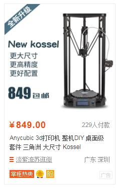
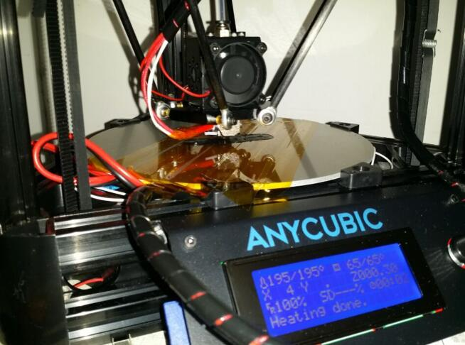
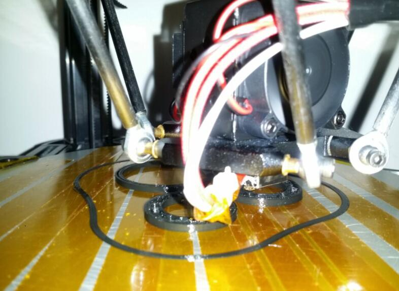
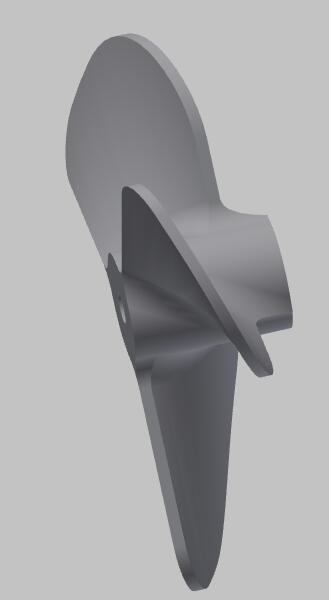
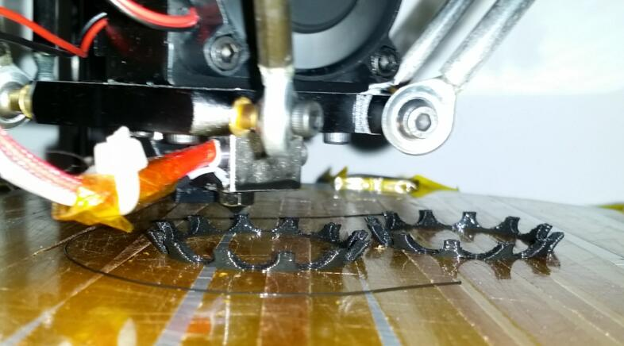
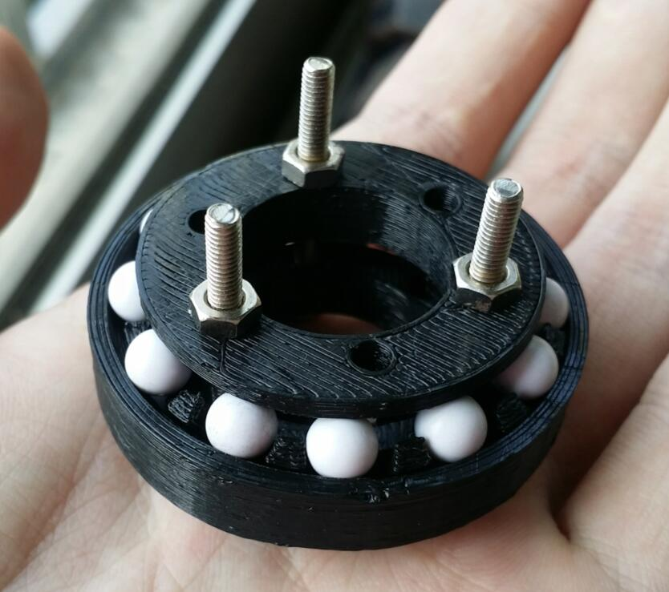

! Anycubic Kossel 心得

# Anycubic Kossel 心得



淘宝上最便宜的3d打印机，深圳anycubic公司出品。很多同学看到价格居然比2d打印机还便宜之后都想买，所以我就在这里把注意事项跟大家写一下吧，毕竟国货，光看说明书肯定是要出事的。


0. 滑车的问题

    anycubic kossel（下称AK）有滑车版和线轨版，一个是用塑料滑车作为轨道，一个是用线性滑轨作为轨道。滑车因为是塑料+橡胶，用力掰就会变形，所以打印的速度、加速度一高，滑车受力、抖动就大，精度就会下降。线性滑轨由于是金属的，刚度很高，就没有这个问题。因此价格差几百块钱可以理解。

    我买的是滑车版。

1. 热床的问题

    AK标配是玻璃床+床面贴纸，不带加热，贴纸表面是3d打印专用表面，对PLA附着力很强。基本上不用担心翘起，拆的时候要用刀子才能铲下来。（建议用刀刃宽而薄的刀子，铲刀最佳）

    我买的是带加热的版本，热床是一大块铝板，铝板背面有加热电路。正确的做法应该是把贴纸贴到铝板上，但是我脑抽了，把贴纸贴到了玻璃板上，再把玻璃板覆盖在铝板上，结果AK的热床固定件高度不足，只能卡住铝板和玻璃板中其一，没办法两个同时卡住。

    只用铝板作为热床表面是不行的，光滑的铝板表面PLA无法附着，会导致打印失败。我用kapton胶带（就是茶色胶带）覆盖了铝板表面，想着胶带也是高聚物，与PLA应该能附着吧，结果是附着力很差，打印到一半一不小心就把之前打印好的弄掉了。

    最终解决方案是在茶色胶带上用粗砂纸轻轻扫过，制造大量刮痕，提高附着力。这样打印的时候不会自己掉下来，打印好之后也不用动刀子，两全其美。

    

    对付台面不粘的另一个办法，是打印第一层和第二层的时候用非常低的速度（比如10mm/s），后面的层再慢慢加速。可以通过机器上的速度旋钮实现。

2. 固件的问题

    预先刷好的是无热床的固件，带热床的固件去商家网盘下载，安装较新版的arduino，然后烧写。烧写的时候注意，pronterface和cura之类能通过串口连接打印机的程序不要开启，因为它们占用了串口，arduino就没法烧写了。

3. 调平的问题

    千万不要在菜单里点level bed（调平打印床面），虽然固件支持，但是AK并没有Z probe（就是测量打印头是否触碰台面的开关），所以打印头会直接戳向铝板。运气不好的话就戳坏了。

    三角洲打印机的调平分两步，第一步是调节三个轴的偏移量，保证运动平面与立柱平行，不然三个轴有高有低的话，打印出来就是斜的。第二步是调整打印平面的凹凸——这是三角洲的特点，参数不正确的时候，实际打印平面可能是碗状的，也可能是拱形的，都会导致打印失败。

    在没有调平之前，不要尝试打印，不要把耗材插入机器。

    第一步当然是安装printrun软件，商家的网盘里面有，上网下载也行。printrun其实就是一个可以向打印机发送控制命令的界面。

    选择正确的串口（在设备管理器里找COMxx，其中xx是串口号），波特率250000，应该能连上打印机。软件的具体用法，G代码的意义，大家自己应该能搞明白。

    **搞不明白的千万不要买**。这里扩展说明一下，安装过程中有很多细节说明书都是没有讲的，但漏掉就会导致失败，所以如果不是DIY经验丰富，买回来一定是给自己找晦气。作者是电、计研究生水平，机械略懂一些，搞过CNC，单片机专业户，会说五种编程语言，仍然感到有大量知识需要学习，整整google了三天三夜。比如说热敏电阻要自己粘到热床背面，不然热床就会烧成火炉；比如加热头的热敏电阻要塞到加热头上的小孔里，然后想办法固定，不然掉出来的话就会不知不觉中把加热头烤红或者烫到自己；加热头和加热头散热片的连接是螺纹，但这个螺纹很松，一定要加生料带，上下用老虎钳固定拧紧，否则PLA会不知不觉渗得到处都是；滑车上的所有螺丝都必须拧紧，一颗螺丝没拧紧，就永远打印不出除了废品之外的东西；皮带一定要用送的弹簧张紧，越紧越好；安装限位开关要分清左右，不然滑车上面的螺丝顶不到限位开关……

    有一些细节没有随机器说明书发过来，要自己去商家的网盘看，这些细节都很重要，都得看。

    printrun（pronterface.exe)连上打印机之后，试试用G代码调节温度，试试G28归位……

    官方说明书提供的调平方法非常傻逼，如下：

    1. 测量Z轴实际最大运行距离
    2. 按照此距离，修改固件
    3. 打印点啥
    4. 如果打印出来一边高一边低，拧滑车上方的螺丝，改变滑车G28归位后的实际距离，从而改变每个轴的偏移量
    5. 重复3,4

    这样当然很痛苦，下面是我建议的调平方法：

    1. 修改固件。商家提供的是某个版本的Marlin改出来的，文件夹名字叫做“For linear and pulley - with hotbed”。修改之后如下：

        configuration.h

        ```cpp
        // EEPROM
        // The microcontroller can store settings in the EEPROM, e.g. max velocity...
        // M500 - stores parameters in EEPROM
        // M501 - reads parameters from EEPROM (if you need reset them after you changed them temporarily).
        // M502 - reverts to the default "factory settings".  You still need to store them in EEPROM afterwards if you want to.
        //define this to enable EEPROM support
        #define EEPROM_SETTINGS
        //to disable EEPROM Serial responses and decrease program space by ~1700 byte: comment this out:
        // please keep turned on if you can.
        #define EEPROM_CHITCHAT
        ```

        Marlin_main.cpp

        ```cpp
            case 28: //G28 Home all Axis one at a time
        #ifdef ENABLE_AUTO_BED_LEVELING
              plan_bed_level_matrix.set_to_identity();  //Reset the plane ("erase" all leveling data)
        #endif //ENABLE_AUTO_BED_LEVELING

        #ifdef NONLINEAR_BED_LEVELING
              reset_bed_level();
        #endif //NONLINEAR_BED_LEVELING

              saved_feedrate = feedrate;
              saved_feedmultiply = feedmultiply;
              feedmultiply = 100;
              previous_millis_cmd = millis();

              enable_endstops(true);

              for(int8_t i=0; i < NUM_AXIS; i++) {
                destination[i] = current_position[i];
              }
              feedrate = 0.0;

        #ifdef DELTA
                  // A delta can only safely home all axis at the same time
                  // all axis have to home at the same time

                  // Move all carriages up together until the first endstop is hit.
                  current_position[X_AXIS] = 0;
                  current_position[Y_AXIS] = 0;
                  current_position[Z_AXIS] = 0;
                  plan_set_position(current_position[X_AXIS], current_position[Y_AXIS], current_position[Z_AXIS], current_position[E_AXIS]);

                  destination[X_AXIS] = 3 * Z_MAX_LENGTH;
                  destination[Y_AXIS] = 3 * Z_MAX_LENGTH;
                  destination[Z_AXIS] = 3 * Z_MAX_LENGTH;
                  feedrate = 1.732 * homing_feedrate[X_AXIS];
                  plan_buffer_line(destination[X_AXIS], destination[Y_AXIS], destination[Z_AXIS], destination[E_AXIS], feedrate/60, active_extruder);
                  st_synchronize();
                  endstops_hit_on_purpose();

                  current_position[X_AXIS] = destination[X_AXIS];
                  current_position[Y_AXIS] = destination[Y_AXIS];
                  current_position[Z_AXIS] = destination[Z_AXIS];

                  // take care of back off and rehome now we are all at the top
                  HOMEAXIS(X);
                  HOMEAXIS(Y);
                  HOMEAXIS(Z);

                  calculate_delta(current_position);
                  // following line modified by Qin Yongliang
                  plan_set_position(delta[X_AXIS]-endstop_adj[0], delta[Y_AXIS]-endstop_adj[1], delta[Z_AXIS]-endstop_adj[2], current_position[E_AXIS]);

        ```

        这样修改之后，我们的AK就能够响应M500（把设置存到EEPROM中）和M666（对三条轨道增加修正量）两个命令了。

        验证：在pronterface里，先G28，然后M666 x-10 y-10 z-10，然后M500，打印机应该返回“保存成功”。然后M501，看我们通过M666设置的内容，是否已经写入EEPROM。写入之后即便断电也是不会丢失的。然后按pronterface界面上的z轴向下1mm的按钮，看看三个轴是否都同时下降了10mm？说明这种方法也能调节偏移量，而且不用调螺丝。（如果你真的想调螺丝：M3螺丝的螺距是0.5mm，如果要调节0.1mm，就拧1/5圈，以此类推。）

        验证完之后，记得复原M666设置。（M666 x0 y0 z0, M500, M501）

    2. 将打印头移动到靠近x轴（打印机的x轴）处，点击界面上z轴（直角坐标系的z轴）向下1mm、向下0.1mm的按钮，直到触底。为了避免打印头损坏，一般用白纸垫在打印头和床面之间，如果白纸来回抽动遇到阻力，就说明已经触底。

        用M114命令读取此时Z轴（直角坐标系的z轴）高度，比如说-30.5，说明在靠近x轴（打印机的X轴）处，床面的高度是-30.5mm。

        将打印头再分别移动到靠近y、z轴(打印机的y、z轴)处，也分别测量高度。

        假如现在测量到了 x-30.5, y-30.9, z-31.2，就说明如果想让直角坐标系的z=0平面和实际床面重合，就要给打印机x,y,z三个轴分别增加-30.5/-30.9/-31.2的偏移量。增加的方法：M666 x-30.5 y-30.9 z-31.2, M500, M501

    3. 将打印机G28归位（或者直接按绿色的z轴归位按钮），重复第2步，直到打印头无论在床面的什么位置，移动到底时，坐标系的z轴均为0.

    上面这个步骤看上去很复杂，但如果把常用操作制作成pronterface里的按钮，速度就很快了。另一个好处是调节很精确，比拧螺丝精确。

    在打印的过程中，如果某一处的丝不粘平台，说明此处偏高；如果某一处的丝被压扁甚至不出丝，说明此处偏低，挤出头刮床；相应微调M666 +-0.1mm，再重新打印，直到效果完美为止。

    打印平面呈碗型和拱形的问题，也可以通过这种Z轴下探的方法测出来，然后按照说明书的指导，去修改固件即可。

3. 切片的问题

    我用cura软件切片（它提供的选项比较智能），然后把生成gcode扔到pronterface里预览和打印（它反馈的信息较全面）。将来我估计会自己写切片脚本。

    在模型周围一定要加衬线（skirt），它会在模型周围画一圈（也可以设成几圈）没有任何用途的线，可以使打印头送料通畅，把打印头上残留的PLA丝留在模型外边；最重要的是，如果出了任何问题（比如打印头刮台面，或者PLA不粘台面），可以在打印模型本身之前就发现并终止。

    

3. 温度的问题

    这个得根据实际耗材和速度设定。我热床设65度，这个温度下第一层略柔软，附着力增强。挤出要设成200度，设180度的话还没挤出来就被旁边的风扇吹冷了。PLA用180度（最低温度）的前提是挤出头的温度和显示器上的温度一致，实际上挤出头的温度会低一些，所以应该设定得高一些。一般来说，打印速度越快，温度也应该越高，避免流量大的时候挤出头被PLA过度冷却，导致细丝、断丝。

    PLA的性质类似玻璃，没有固定的熔点，在100度附近可以抽丝，在60度以上失去刚性，50度左右恢复刚性。每次作品打印完我会命令打印头移到台面上方，风扇开启，帮助台面降温；降到50度的时候就可以把打印好的作品拔下来了。

## 风扇叶

扇叶厚度不到0.5mm，利用支撑打出来的，强度很好。




## 球轴承

终于为尘封多年的6mmABS塑料小球（你懂的）找到用途了。。。


这个是滚珠架




这个设计可以同时承受轴向和径向载荷:



