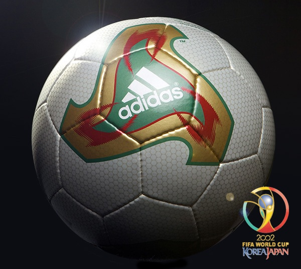
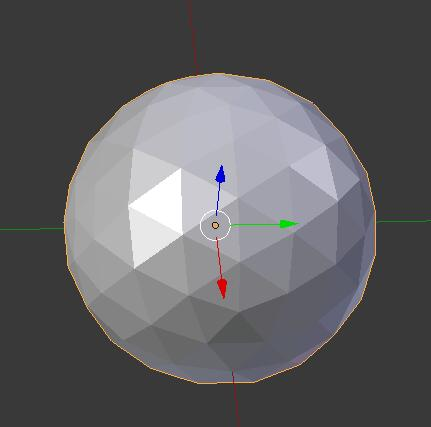
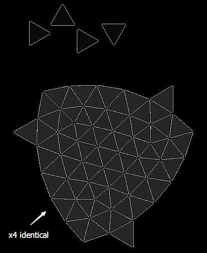
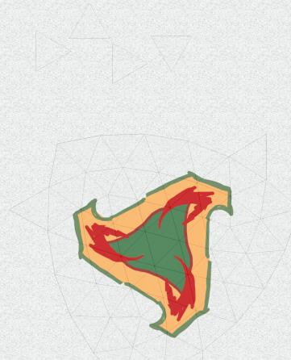
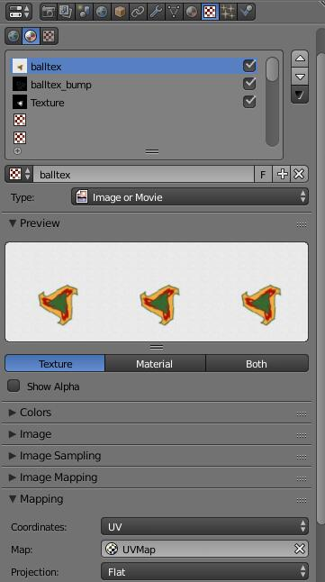

! Make a Ferenova

# Make yourself a Ferenova

Ferenova is the official ball of FIFA World Cup 2002.

I like its design very much. Below are the steps I took to make it available in Unity3D.

## Detailed steps

1. (Blender) create an icosphere

    

2. Cut seams for UV unwrapping

    

3. Unwrap

    

4. Paint the textures in Photoshop

    

    

5. Resulting textures

    

6. Get back to blender and import these textures, then map them to the scorresponding input channels (color, normal, etc.)

    

    

7. Not bad! Export the Blender scene to FBX format, then import it to Unity.

    Assign the icosphere mesh to a sphere object.

    Assign the textures to the material.

    

8. Here's what we got:

    

If you felt that I wasn't clear enough, courses on Computer Graphics are highly recommended.
