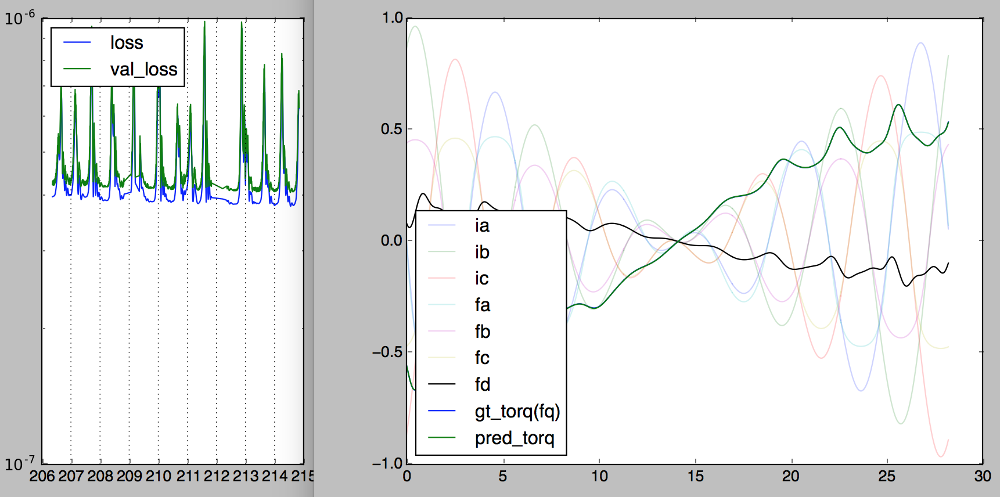
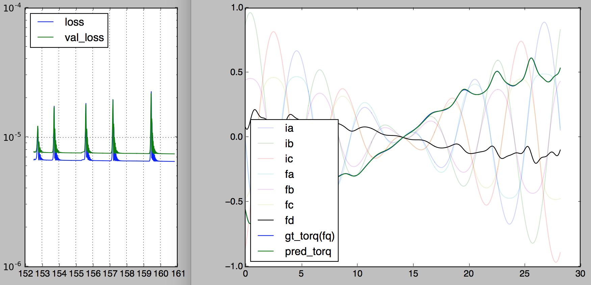

!Activation Functions

# Comparison of Activation Functions 激励函数比较

## problem description

data source

- non-linear unbalanced imperfect PMSM motor

training data

- phase currents sampled from normal distribution

- rotor phase angle sampled from uniform distribution

- resulting static torque

- 1000 training, 500 validation

network architecture:

```text
input: 3-phase currents & rotor phase angle
output: torque

currents[3]
    ->dense[3](activation)->dense[3](activation)->dense[5](activation)
    ->c1

angle[1]->sin_and_cos[2]
    ->dense[3](activation)->dense[3](activation)->dense[5](activation)
    ->c2

(c1[5] * c2[5]) -> dense[1] -> torque[1]

91 free parameters
```

objective

- predict torque based on phase currents and rotor angle.

training

- Adam optimizer

- minimize mean-squared difference (MSE) of predicted angle and actual angle

# visualizations

- motor torque driven by 3-phase sine wave, actual `gt_torq` vs predicted `pred_torq`

- left plot x-axis: time elapsed (seconds)

## ReLU

- won't work for obvious reasons.


## sigmoid(logistic)

- good for logicstic regression, bad for real-valued data


## softplus

- integral of sigmoid

- what ReLU used to look like

- bad for real-valued data (lacked minus part)


## tanh

- best for real-valued data

- least overfit + best performance among all activations tested




## tanhsinc: tanh(x) * sin(x) / x

- care more about local details

- turn underfit into overfit instantly


## ELU

- *visual* coolness of ReLU

- smoothness of softplus

- gradient-friendliness of tanh

- works with both real-valued data and images



## Leaky ReLU (0.5)

- just in case you wonder


