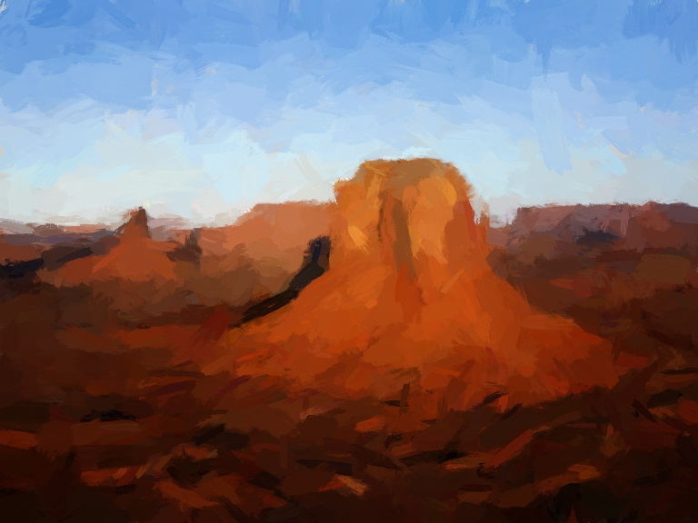

!Training of Artists

# Training of Artists

How to train an artist? for example to paint?

To answer that question, we must first answer: What do artists do. Another way to look at this question would be, what artists can do that normal people just can't?

An average painter who paint for a living must be able to paint a lot of things. Faces, objects... he must be able to produce photorealistic results of almost any subject.

To better illustrate the process of painting, consider the following algorithm:

1. Compare the image of canvas C with scene S and calculate their difference:

    >d1 = (C - S)^2.

2. Paint a stroke K somewhere on canvas C, calculate the difference again:

    >d2 = (Paint(C,K) - S)^2

3. If d2 < d1, keep the stroke K; otherwise remove it.

4. Goto Step 1.

This algorithm is guaranteed to reduce the mean-squared difference between C and S if we run it for sufficiently long.

However it has several flaws:

1. The perceptive difference between C and S is not the mean-squared difference of the images. We humans care more about some details than others, for example we care more about faces of human than rocks and trees. Most of the artist's work is spent on Mona Lisa's face, not the background. So the algorithm above does not converge towards minimal perceptive difference. (it will eventually, but takes forever)

2. Where should we paint the stroke K? In what color? Well we may use the Monte-Carlo method: Draw the parameters of K from a uniform distribution. The algorithm will eventually converge, but that again takes forever (too high regret rate, too many retries).

3. If we can't remove a painted stroke (say watercolor), this algorithm will not converge. This is why oil painting was so important to Renaissance: You can't mass produce artwork if you can't undo your mistakes.

So the differences between artists and non-artists are quite clear now: We human certainly can't run the algorithm above faster than a computer, so the artists must be using a better algorithm.

1. An artist must estimate perceptive difference very efficiently with very high accuracy.

2. An artist must choose the parameters for K very efficiently with very low regret rate.

3. An artist must be able to do in-brain simulation before painting strokes, in case where mistakes are expensive to undo.

Indeed, the typical training a human artist receives when he attend an art school strengthen their: estimation of preceptive difference, instinct for stroke placement, in-brain image formation.

So, why don't we train the computer like an artist, to paint for us?

A while ago I wrote a program which paints realistic oil brush strokes. Using mean-squared difference and per-stroke per-parameter gradient descent it converges just fine(thousands of strokes in minutes).

- But the perceptive difference is decreasing too slowly. The painting looked flat and boring.

Update 20171201: The code/script to place strokes on canvas wherever the MSE is large, and adjust parameters of the stroke via local gradient descent, to produce an oil-brush styled painting, is available at <https://github.com/ctmakro/opencv_playground>.

So I ran an instance of VGG16 to calculate the perceptive difference of two images from one of the intermediate layers' activations, instead of mean-square difference.

Since VGG16 is trained for image classification, it sure knows what features in images are important for human activities.

Here's what I got:

Cool.

- But now the algorithm slows down. Neural networks are 1000x slower than mean-square; the gradients calculated by numerical differentiation (since the stroke process is not differentiable) on 8 parameters evaluate the neural network for 9 times.

- Good news: perceptive difference can be estimated with a neural network trained on ImageNet.

- Bad news: although gradient descent is 1e7 times more efficient than Monte-Carlo, still not efficient enough.

Upcoming: I'm going to train a network that predicts optimal parameters for K very accurately based on current C and S. If this succeeds we may achieve a speed gain of about 50x. With RL techniques the network may even learn how to plan the strokes ahead to form special patterns.
