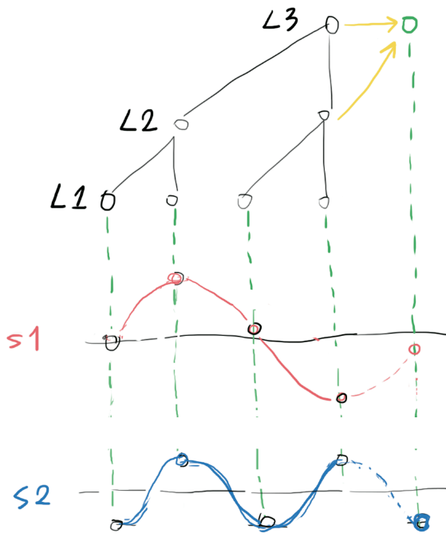
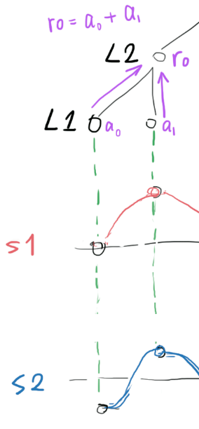
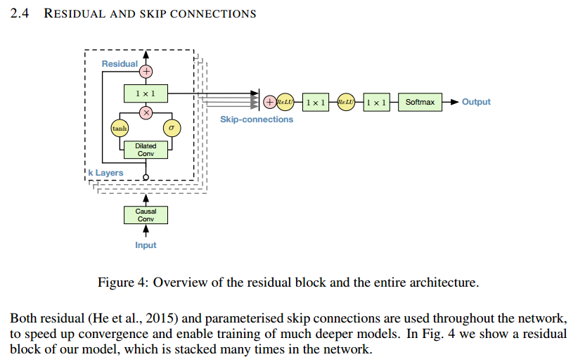

! Behind WaveNet

# Behind WaveNet

WaveNet <https://arxiv.org/pdf/1609.03499.pdf> is a convolutional neural network architecture that takes a bunch of audio samples as input, and predicts the next sample.

It worked so well(speech generation, music audio generation), so why?

## My explaination

Any audio signal can be synthesized with a collection of sine waves(or wavelets) of different frequencies. If we know the frequency, phase and amplitude of each of the sine waves(or wavelets), it is trivial to predict the amplitude of the next sample.

Just like the image shown above: two sinewave S1 and S2 are marked in red and blue, given their frequency `f`, phase `theta` and amplitude `A`, predicting their next sample would be as simple as calculating `Asin((2pi + theta) * f)`. So if we could decompose the incoming audio signal into a bunch of sinewaves, predicting the next sample would be as easy as `sum(sin(each sinewave parameters))`

WaveNet does EXACTLY that, but in the neural network way (so nonlinearties of various kind could be added and trained to deal with real world problems).

1. assume the input signal s1+s2 is being sampled at a frequency of `fs`, and the L1-L2 convolution kernel(drawn in cyan) is sensitive to the difference between two samples.

    

    obviously, after the L1-L2 convolution, signal of frequency `fs/2` (like the blue S2) will produce high activation (`b0`) in L2.

    L2 can now say, "I saw a signal of frequency `fs/2` of amplitude `b0 = a0 - a1`".

2. L1 may also pass bias (common part of `a0` and `a1`) information to L2(using the Residual connection drawn in purple).

    

    L2 can now say, "apart of that, I also saw a bias of `r0 = a0 + b0`".

3. then after the L2-L3 convolution, signal of frequency `fs/4` (like the red S1) will produce high activation (`b1`) in L3.

    

    L3 can now say, "I saw a signal of frequency `fs/4` of amplitude `b1 = r0 - r1`".

4. so if we repeat this structure `N` times, we can extract the amplitude(and phase, won't go into detail here) information of sinewaves of frequency `fs/2, fs/4, fs/8 ... fs/2^N`.

5. Then in order to predict the next sample using functions like `sum(sin(each sinewave parameters))`, we feed information from different frequencies to the output, using skip connections(yellow).

    

So the idea here is simple: decompose incoming waveform into different frequencies, extract parameters(amplitude and phase), then predict the next sample based on the parameters. So you might ask, why don't they just use FFT, or other well-established frequency domain analysis method??? Since after all, their 1D dilated convolutions are just doing the job of DFT.

I don't know either, but Facebook just found out how to do 2D convolution with FFT (<https://github.com/facebook/fbcunn>), so the same thing could happen to WaveNet too.

## Original description in the WaveNet paper

As I explained above, those "skip connections" are required since the prediction network won't function without information from those connections. However, DeepMind gave very few comments on "skip connections", describing it like a trick:

