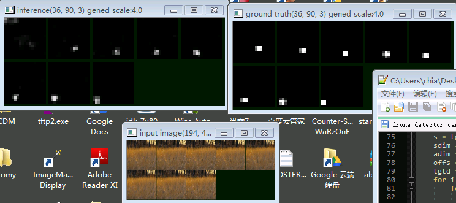

!GRU and Convolutional GRU

# GRU and Convolutional GRU

GRU, compared to LSTM,

- is easier to implement
- requires fewer (steps of) computation
- no difference in capacity

## GRU - fake text generation

Implementation:

```py
# single forward pass version of GRU. Normally we don't use this directly
class GRU_onepass(Can):
    def __init__(self,num_in,num_h):
        super().__init__()
        # assume input has dimension num_in.
        self.num_in,self.num_h = num_in, num_h
        self.wz = Dense(num_in+num_h,num_h,bias=False)
        self.wr = Dense(num_in+num_h,num_h,bias=False)
        self.w = Dense(num_in+num_h,num_h,bias=False)
        self.incan([self.wz,self.wr,self.w])
        # http://colah.github.io/posts/2015-08-Understanding-LSTMs/

    def __call__(self,i):
        # assume hidden, input is of shape [batch,num_h] and [batch,num_in]
        hidden = i[0]
        inp = i[1]
        wz,wr,w = self.wz,self.wr,self.w
        dims = tf.rank(inp)
        c = tf.concat([hidden,inp],axis=dims-1)
        z = tf.sigmoid(wz(c))
        r = tf.sigmoid(wr(c))
        h_c = tf.tanh(w(tf.concat([hidden*r,inp],axis=dims-1)))
        h_new = (1-z) * hidden + z * h_c
        return h_new
```
(source available at <https://github.com/ctmakro/canton/blob/master/canton/cans.py>)

The instance below is trained (on some English text) to predict next character based on previous characters. Characters are one-hot encoded bytes. Yes, 256 classes, which means this model will work with multibyte languages.

```text
In [1]: mymodel.load_weights('mymodel.npy')
successfully loaded from mymodel.npy
7 weights assigned.
Out[1]: True

In [2]: show2(1000)
? The cacked philosophy this smull resplie time, sacrity soncelse intrulvevelly
weach. But DETt out rety bat
belowed and hadbitions of selquets not more,
there, the
spect the dees and that the foundeed and mo but has forthither protubled dure:
whone of his, itself proup of arobemations of be incrised heals dationar what it
Go his light
reed of ruspect a modelr these forse'st
case of with what is
philosophers anjuring adrreaders
of wittout," that morust means do thithis now whay atajizater of stares. If of
with mean vorigenly motaphysically, furselves they seck ont allieater
over octer sesper as a nature as gievinence, and naturefless sume creally of
hume of a deintatish" and the makions
with underivally this
adymedtiams moods not crually. Till but benounger enoundflle: with is prevement his
face: the astore Will
religions, 's ortas and ciscesching ho to arn the peispepies than our offer or
the juttity; and will
pesceple! it wisking the blowners broug dived, been thrighten acompthe it w
```
code available at <https://github.com/ctmakro/hellotensor/blob/master/gru_text_generation.py>

## Convolutional GRU - object tracking

This technique (Convolutional Recurrence) is not widely used until recently: <http://vision.ouc.edu.cn/valse/slides/20160323/VALSE-Xingjian.pdf> (ConvLSTM)

Basically, by using a convolutional recurrent network we can now model **spatiotemporal relationships**. In plain English: You can **extract and exploit movement information** from image sequences. This greatly improves, e.g., the performance of object trackers.

The implementation of ConvGRU in Canton framework is very simple. Just replace the Dense layers with Conv2D:

```py
# single forward pass version of GRUConv2D.
class GRUConv2D_onepass(GRU_onepass): # inherit the __call__ method
    def __init__(self,num_in,num_h,*args,**kwargs):
        Can.__init__(self)
        # assume input has dimension num_in.
        self.num_in,self.num_h = num_in, num_h
        self.wz = Conv2D(num_in+num_h,num_h,usebias=False,*args,**kwargs)
        self.wr = Conv2D(num_in+num_h,num_h,usebias=False,*args,**kwargs)
        self.w = Conv2D(num_in+num_h,num_h,usebias=False,*args,**kwargs)
        self.incan([self.wz,self.wr,self.w])
```
(source available at <https://github.com/ctmakro/canton/blob/master/canton/cans.py>)

The instance below (regular convolution + recurrent convolution) is trained on a drone fly-by dataset. For each scene there are 8 consecutive images with a drone flying across. The network should output 1 where it believe is a drone; 0 otherwise.


**Top left:** Network output, from t0...t7. **Top right:** Ground Truth (where the drone is). **Bottom:** Input images

As you can see in the beginning (t0) the network cannot tell the drone apart from the background. But after every step  its belief changes a little; Finally after 3 steps it gained enough information about the scene, successfully seperating the drone (white) from the background (black).

**Below:** Without the help of motion, even human can barely detect anything from the images. Again, the network gradually adjusted its belief about the moving object over time.



code available at <https://github.com/ctmakro/hellotensor/blob/master/drone_detector_canton2.py>
