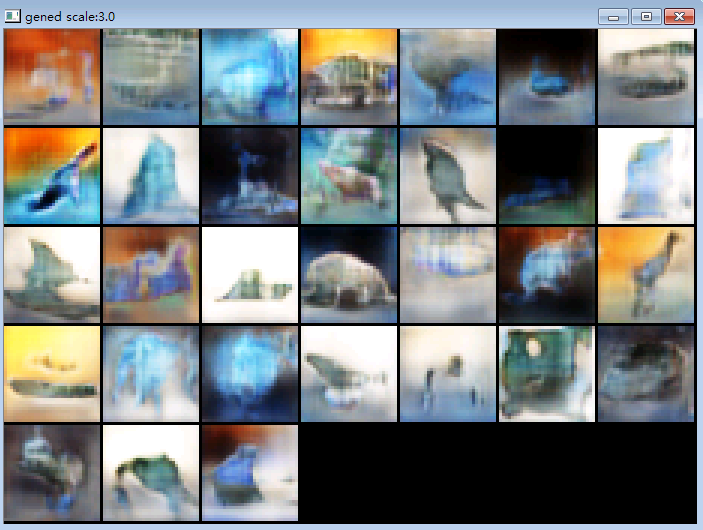

!Fast LSGAN in Canton

# Fast LSGAN in Canton (TensorFlow)

LSGAN(<https://arxiv.org/pdf/1611.04076v2.pdf>) is basically DCGAN with MSE loss. (LS for Least Square)

In DCGAN we use sigmoid + cross entropy, so gradients could vanish, which might not be good for learning. In LSGAN the author removed sigmoid and replaced cross entropy with MSE.

```py
generated = g(noise)
gscore = d(generated)
rscore = d(real_data)

# original DCGAN(with single side label smoothing)
dloss = - (log_eps(1-gscore) + .1 * log_eps(1-rscore)+ .9 * log_eps(rscore))
gloss = - log_eps(gscore)

# LSGAN
# note: remove the sigmoid from the discriminator
dloss = tf.reduce_mean((gscore-0)**2 + (rscore-1)**2)
gloss = tf.reduce_mean((gscore-1)**2)
```

the code is available at <https://github.com/ctmakro/hellotensor/blob/master/lets_gan_canton.py>.

You should use the same Adam setting as in DCGAN (I use `lr=1e-4, beta1=0.5`), otherwise the whole thing may not converge.

result:

(after ~40000 x 32 examples):



> I think the results looked significantly better than those produced by DCGAN.

after convergence i think it would be boring just producing a minibatch of 32x32 images and post it here, so i increased the size of the input to the generator, generating large patches:

(after ~20000 x 32 exampes)

LSGAN


DCGAN


>Without the help of image borders, the filters lost the direction to propagate to produce single objects, that's why you can't see meaningful objects in these images

I'm not sure whether above networks are underfitting or simply require more training.

(placeholder: train overnight and see what happens)

## Notes

1. Please Do Use batch discrimination (within one minibatch, calculate each sample's distance to other samples, then provide that distance as a feature map to next conv layer). The earlier version of my code includes a not-very-good implementation that prevents generator from generating a full batch of identical samples, but won't work if only some of the samples are identical.

    according to <https://arxiv.org/abs/1606.03498>, their batch discriminator consist of a trainable tensor, by multiplying input batch with that tensor you get a vector of discriminating features.

    Instead I simply calculate the L1 diff between tensors, then apply exp(- abs_diff) :

    ```py
    def batch_disc(i):
        #assume i shape [N H W C]
        s = tf.shape(i)
        NHWC1 = tf.expand_dims(i,4)
        AHWCN = tf.expand_dims(tf.transpose(i,[1,2,3,0]),0)
        diffs = NHWC1 - AHWCN # [N H W C N]
        abs_diffs = tf.abs(diffs)
        # shape [N H W C N]
        feat = tf.reduce_mean(tf.exp(-abs_diffs), [3,4])#[N H W]
        feat = tf.expand_dims(feat,3)
        # shape [N H W 1]
        out = tf.concat([i, feat],axis=-1) # [N H W C+1]
        return out
    ```

    batch discrimination is very, very important. you can learn more tricks on Ferenc's site <http://www.inference.vc>

2. Instance Noise

    add noise to both the generator output and the real images, before feeding them into the discriminator.

    ```py
    inl = tf.Variable(1.)

    def noisy(i):
        return i + tf.random_normal(mean=0,stddev=inl,shape=tf.shape(i))

    generated = g(noise)

    gscore = d(noisy(generated))
    rscore = d(noisy(real_data))
    ```
    then decrease it overtime. This technique blurs the border between the distributions of the generated examples and the real ones, making it harder for the discriminator, and easier for the generator. due to the noise, the discriminator cannot use details to discriminate between real and fake examples, therefore it wont force the generator to generate details (that could lead to mode collapse) in the beginning.

3. too much tricks

    to get results like those in goodfellow's paper, you have to try all his tricks. I don't have time for that...


## Notes on deconv (or conv2d_transpose)

DCGAN uses deconv to upsample images.

1. inconvenient (you have to set output shapes manually)
2. produce tiling artifacts

instead we use nearest neighbour upsampling, offered in `canton` as `ct.Up2D()`, followed by a conv2d.

here's our Generator implementation:

```py
def gen_gen():
    c = Can()
    def deconv(nip,nop,tail=True,upscale=2):
        dc = Can()
        dc.add(Up2D(upscale))
        dc.add(Conv2D(nip,nop,k=4,std=1,usebias=not tail))
        if tail:
            dc.add(BatchNorm(nop))
            dc.add(Act('relu'))
        dc.chain()
        return dc

    ngf = 32
    c.add(deconv(zed,ngf*8,upscale=4)) #4
    c.add(deconv(ngf*8,ngf*4))
    c.add(deconv(ngf*4,ngf*2))
    c.add(deconv(ngf*2,ngf*1)) #32
    c.add(deconv(ngf*1,3,tail=False,upscale=1))
    c.add(Act('tanh'))
    c.chain()
    return c
```

The generated quality is better than using deconv. No checkboard, yet banding still. For best upsampling behavior, you should consider ESPCN (<http://www.inference.vc/holiday-special-deriving-the-subpixel-cnn-from-first-principles/>).

## What is Canton

A lightweight wrapper around TensorFlow. It offers convenience of Keras but never get into your way. It's also much faster at construction because it doesn't check the shapes.

you may fork canton on GitHub or `pip install canton`.
