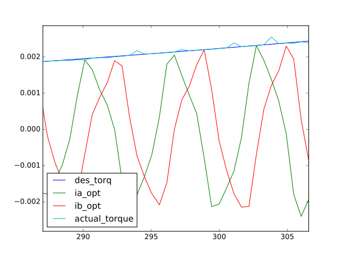

!Learn models of motors

# Learn models of motors (WIP)

introduce a way to learn models of (imperfect or non-symmetrical) PMSM motors and models to control them.

## background knowledge

PMSM motors rotate because two fields interact and produce torque.

- stator field = nonlinearity(input currents)

- rotor field = nonlinearity(sin(rotor angle), cos(rotor angle))

- static torque T = dot(stator field, rotor field)

## first steps

1. drive the motor stochastically: sample input phase current `Ia` and `Ib` from normal distribution, and rotor angle `theta` from uniform distribution

2. measure output torque

now you have data pairs in the form of `(phase current Ia, phase current Ib, rotor angle theta) -> (torque T)`

## learn motor_model

```text
Neural Network

phase_currents[2] -> Dense[3](tanh) -> Dense[5](tanh) -> c1[5]

rotor_angle[1] -> sin_and_cos[2] -> Dense[3](tanh) -> Dense[5](tanh) -> c2[5]

// replace Dense[3] with Dense[poles*3] to deal with multi-pole motors

(c1[5] * c2[5]) -> Dense[1] -> torque[1]

```

number of datapoints must > number of network parameters, to prevent overfit. typically you will need 100 datapoints for 60-80 parameters.

train the network with MSE loss and *Adam* optimizer.

result:


the model predicts the torque output(given current and rotor angle) perfectly.

>for more results using different activation functions, check [Activations](../activations/index.html).

now you have the motor_model.

## current regression

many combinations of phase currents can produce the same torque, but only one of them is optimal (generates only torque and no heat).

textbooks on PM motors will tell you that,

> greatest torque will be generated when stator field is perpendicular to the rotor field.

traditionally, rotor field angle is estimated from rotor angle but that assumes your rotor is perfectly symmetrical. how could we know the optimal current to produce the optimal magnetic field to drive an imperfect/ non-symmetrical motor?

since we already have motor_model, the problem reduce to:

> given any torque T and any angle theta, find phase currents `Ia` and `Ib` that satisfies `motor_model(Ia,Ib,theta) == T`, same time try to minimize `Ia^2` and `Ib^2`.

```text
Neural Network

(phase_currents_in_question[2], rotor_angle[1]) -> motor_model -> torque[1]

```

generate a list of rotor angles and torque numbers, then feed them to the network.

train the network input layer (the phase currents) with MSE loss + L2 regularization(prefer smaller values of Ia and Ib) with *Adam* optimizer. the rest of the network weights should be frozen.

result:



the `phase_currents_in_question` are learned from white noise to generate desired torque. the actual torque (estimated using motor_model given `Ia` and `Ib`) is very close to the desired torque.

now you have data pairs in the form of `(rotor angle theta, torque T) -> (phase current Ia, phase current Ib)`. most importantly, the current values are now optimal for the given torque and angle.

you should generate at least 1000 points of data, to prevent overfit in the next section.

## learn control_model

We can learn a torque-current model from the data pairs generated. given the desired torque and rotor angle, the model should be able to predict phase currents `Ia` and `Ib` (that could produce the desired torque) accurately.

```text

rotor_angle[1] -> sin_and_cos[2] -> Dense[3](tanh) -> Dense[12](tanh) -> c1

desired_torque[1] -> Dense[3](tanh) -> Dense[12](tanh) -> c2

(c1[12] * c2[12]) -> Dense[4](tanh) -> Dense[4](tanh) -> Dense[2] -> currents[2]

```

this network is more complex than previous ones since the underlying process is harder to fit than previous ones.

>*one-to-many* is harder to fit than *many-to-one*

after training, we should be able to control the PMSM motor in torque mode, with an encoder, by generating appropriate phase currents from our neural network model.

here's the result:


