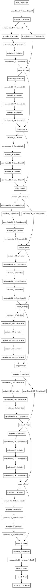

!Residual Network in Keras

# Residual Convolutional Neural Network (ResNet) in Keras

ResNet is famous for:

- incredible depth

- simple architecture / tiny number of parameters

- easy to train / spectacular performance

- won too much competition

There are two versions of ResNet, the original version and the modified version (better performance).

Reference:

- (original) *Deep Residual Learning for Image Recognition*, Kaiming He and Xiangyu Zhang and Shaoqing Ren and Jian Sun, arXiv:1512.03385

- (modified) *Identity Mappings in Deep Residual Networks*, Kaiming He and Xiangyu Zhang and Shaoqing Ren and Jian Sun, arXiv:1603.05027


Here I implement the modified version in Keras.

- keras 1.20

- tensorflow 0.12 windows

Notes:

- the layer counts are customized (3 residual stacks, a total of 10 convolutional layers) for my own purpose.

- !! No batch normalization layers included due to laziness. I wrote this mainly to play with CIFAR-10.

- to replicate their results, you have to modify the code according to their paper or their Torch code on github.

- for pre-trained ResNet-50, please check <https://keras.io/applications/>

```python
def relu(x):
    return Activation('relu')(x)

def neck(nip,nop,stride):
    # nInputPlane, nOutputPlane, stride
    def unit(x):
        nBottleneckPlane = int(nop / 4)
        nbp = nBottleneckPlane

        if nip==nop:
            ident = x

            x = relu(x)
            x = Convolution2D(nbp,1,1,
            subsample=(stride,stride))(x)

            x = relu(x)
            x = Convolution2D(nbp,3,3,border_mode='same')(x)

            x = relu(x)
            x = Convolution2D(nop,1,1)(x)

            out = merge([ident,x],mode='sum')
        else:
            x = relu(x)
            ident = x

            x = Convolution2D(nbp,1,1,
            subsample=(stride,stride))(x)

            x = relu(x)
            x = Convolution2D(nbp,3,3,border_mode='same')(x)

            x = relu(x)
            x = Convolution2D(nop,1,1)(x)

            ident = Convolution2D(nop,1,1,
            subsample=(stride,stride))(ident)

            out = merge([ident,x],mode='sum')

        return out
    return unit

def cake(nip,nop,layers,std):
    def unit(x):
        for i in range(layers):
            if i==0:
                x = neck(nip,nop,std)(x)
            else:
                x = neck(nop,nop,1)(x)
        return x
    return unit

inp = Input(shape=(32,32,3))
i = inp

i = Convolution2D(16,3,3,border_mode='same')(i)

i = cake(16,32,3,1)(i)
i = cake(32,64,3,2)(i)
i = cake(64,128,3,2)(i)

i = relu(i)
i = AveragePooling2D(pool_size=(8,8),border_mode='valid')(i)
i = Flatten()(i)

i = Dense(10)(i)
i = Activation('softmax')(i)

model = Model(input=inp,output=i)
```

