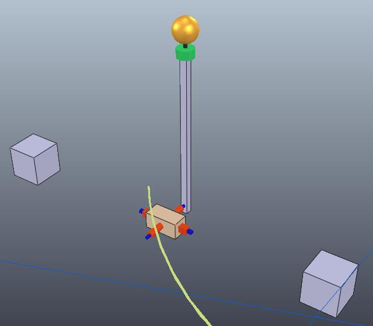

!V-REP + Gym = RL

# V-REP + OpenAI Gym = RL

V-REP: The powerful, user friendly, and free-to-use robot simulation platform for researchers and hackers. Supports basically everything.

OpenAI Gym: The de facto standard interface for Reinforcement Learning.

So, how can we hook V-REP onto an Gym environment, so that we could perform 3D robotic simulations step-by-step in Python?

## Remote Controlled V-REP

V-REP provides a set of APIs accessible from socket, with dynamic libraries and binding for Python, Lua and a bunch of languages.

You will have to write some python code to:

1. Start a V-REP instance from Python
2. Connect to the instance you've started
3. Load the scene file (the scene we are about to simulate)
4. Start the simulation
5. Step the simulation
6. Read/Write something from/to V-REP to control the simulation and record data
7. Goto 5 several times
8. Stop the simulation
9. (Important) Check to see if the simulation actually stopped.
10. Goto 4 several times
11. Kill the V-REP instance from python if no longer needed.

Which means a lot of code.

Good news: I wrote a library called `vrepper`, available at <https://github.com/ctmakro/vrepper>, that could correctly handle the routine mentioned above. You should at least look at the code - which may save you a lot of precious time, that I've spent already.

You may expand your own functionality. Consult V-REP's Remote API manual.

## An example on the usage of `vrepper`

Here I made a 3D cart-pole environment in V-REP.



It contains camera output rendered with OpenGL in V-REP, so that you could see how the simulation went with V-REP running in headless mode (mode without GUI).

video demonstration below:

<video controls loop autoplay src="vrep.mp4"></video>

To run the example above, here's what you have to do:

```bash
# install V-REP 3.40 (latest version as the time of writing) for your operating system. Make sure the vrep executable is in your PATH variable.

$ pip install tensorflow numpy
$ pip install canton

$ pip install opencv-python # won't always work. Just make sure you have OpenCV3 installed, and you could "import cv2" in Python.

$ git clone https://github.com/ctmakro/cv2tools # visualization utility
$ pip install -e ./cv2tools
$ git clone https://github.com/ctmakro/vrepper
$ pip install -e ./vrepper

$ git clone https://github.com/ctmakro/gymnastics
$ cd gymnastics

# then simply follow the video:
$ ipython -i test_cartpole.py

agent.load_weights() # load the neural network weights
test()

```

Happy learning!
